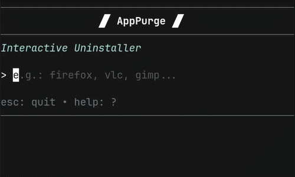

# 🗑 AppPurge

**Interactive TUI uninstaller** — search and remove programs from APT, Flatpak, Snap and AppImage through a clean terminal interface.

Built with [Bubble Tea](https://github.com/charmbracelet/bubbletea).

## Screenshot



## Requirements

- **Go 1.18+** — [Download](https://go.dev/dl/)
- **GNU Make** — usually pre-installed on Debian, Arch, Fedora, etc.

APT, Flatpak and Snap are auto-detected if installed. Missing package managers are simply skipped.

## Installation

```bash
git clone https://github.com/Zobercito/apppurge.git
cd apppurge
make build          # compiles to build/apppurge
sudo make install   # copies to /usr/local/bin/
```

You can also run the binary directly without installing:

```bash
./build/apppurge
```

Or install it with Go:

```bash
go install github.com/Zobercito/apppurge@latest
```

## Usage

```bash
apppurge              # interactive mode (prompts for package name)
apppurge firefox      # search directly for a package
apppurge -h           # show help
```

## Supported package managers

| Source | Description |
|--------|-------------|
| **APT** | System packages (Debian, Ubuntu, Mint, etc.) |
| **Flatpak** | Flatpak applications |
| **Snap** | Snap packages |
| **AppImage** | AppImage files in `~/Applications`, `~/Downloads`, `~/.local/share/Applications` |

## Uninstall modes

- **Normal** — Removes the program, keeps configuration files
- **Complete** — Removes the program and all its data (config, cache, local state)

## Features

- Interactive TUI with keyboard navigation (`↑/↓`, `enter`, `esc`)
- Real-time parallel search across all package managers
- Per-source filtering (`1`=APT, `2`=Flatpak, `3`=Snap, `4`=AppImage)
- Dry-run mode to preview what would be deleted
- Package info viewer (version, size, description, reverse dependencies)
- Uninstall history in `~/.config/apppurge/history.json`
- Package name and path validation to prevent injection
- Protected system packages list (kernel, systemd, etc.)
- Color-coded sources: APT=teal, Flatpak=violet, Snap=orange, AppImage=pink

## Development

```bash
make build    # compile
make test     # run tests
make lint     # golangci-lint
make fmt      # go fmt
make clean    # remove build artifacts
```

## Notes

- Commands requiring admin privileges (`apt remove`, `snap remove`) auto-elevate with `sudo`.
- Missing `flatpak` or `snap` are silently skipped.
- Uninstall history is stored in `~/.config/apppurge/history.json`.

## License

GNU General Public License v3.0 — see [LICENSE](LICENSE).
